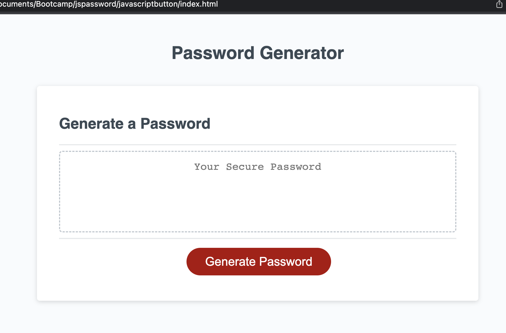
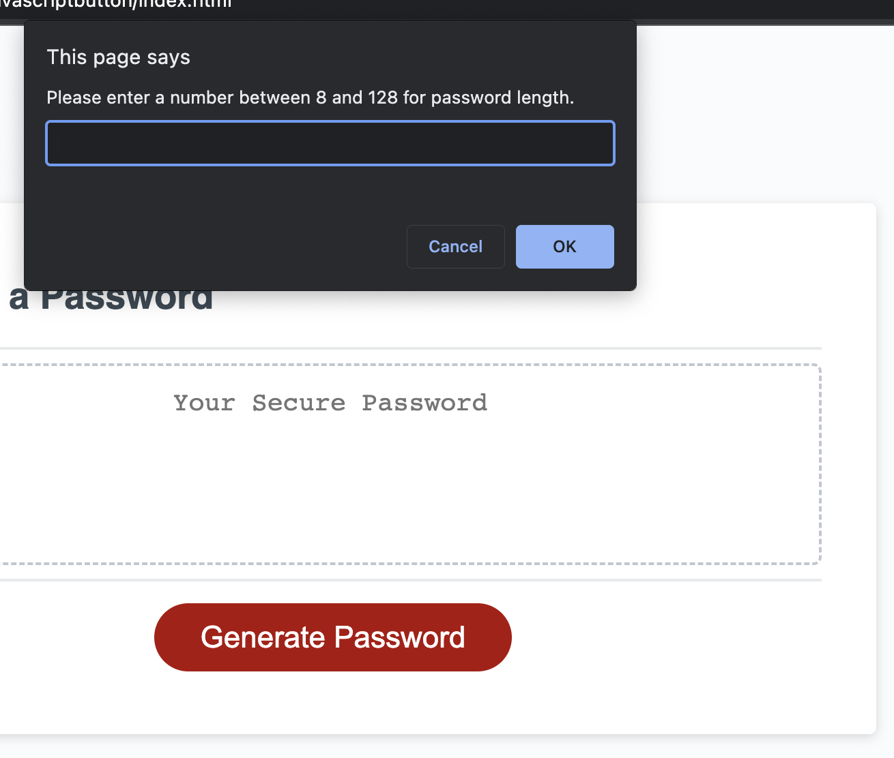
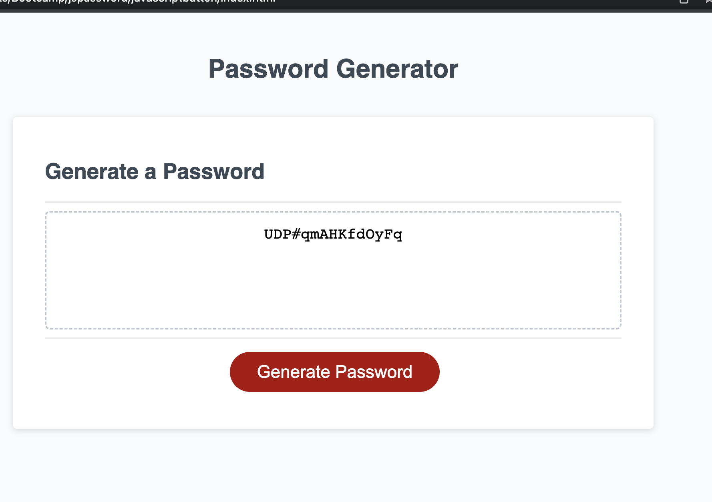

# javascriptbutton
This is a basic javascript 

## Description
This password generator is for use when you would like to create a password that require specific criteria. Using JavaScript once you click the generate password button you will be gretted with prompts to input and select whether or not you want specific items in your password. Options you will have are below:

- Password length
- Upper case letters 
- Lower case letters
- Numbers
- Special Characters

## Examples
Below are snippets of what the page looks like before clicking the generate button, what the prompt pop-up with look like and what the final output will look like.

## Usage
The elements behind this page are important functions for helping a user create a random password that meet specific criterias. 